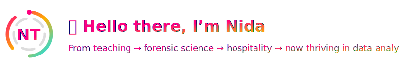

  

---
 ## ABOUT ME 💁🏻‍♀️

- 💼 Currently working as an IT Analyst, focusing on process optimization, reporting solutions, system improvements, and business-driven technology initiatives.
- 🚀 Continuously enhancing my technical stack through hands-on projects involving Power BI, SQL, Python, SAP SuccessFactors, RPA, and workflow automation.
- 📊 Passionate about transforming operational data into actionable insights through dashboards, analytics, and process improvement strategies.
- 🛠️ Actively building real-world projects to strengthen my expertise in Data Analytics, Business Intelligence, Automation, and IT Operations.
- 🌱 Dedicated to continuous learning, exploring emerging technologies, automation frameworks, and data-driven solutions to improve business efficiency.
- 👯 I’m looking to collaborate on **open-source data projects, case studies, and analysis challenges** that highlight creativity and practical impact.   
- 💬 Ask me about **customer insights, turning operations into numbers, visual storytelling, and how to teach complex topics simply**  
- 😄 Pronouns: **She/Her**  
- ⚡ Fun fact: Whether teaching a class, studying crime scenes, or managing a buzzing restaurant floor — I’ve always chased clarity. Now I just happen to find it in data. 🔍📊
  
---

## 🌍 Skills That Translate Across Domains

🎯 **IT Analyst → Process Optimization & Business Solutions**  
Currently working as an IT Analyst, contributing to workflow optimization, reporting transformation, automation initiatives, and operational improvement projects across business functions. Experienced in aligning technology solutions with business objectives through data-driven decision-making and stakeholder collaboration.

📊 **Teaching → Communication & Simplification**  
Able to break down complex technical concepts into clear, actionable insights — helping bridge the gap between technical teams and business stakeholders through effective communication and reporting.

🧪 **Forensics → Analytical Rigor & Attention to Detail**  
Forensic training strengthened my ability to identify patterns, investigate anomalies, and build evidence-based conclusions — skills that directly enhance data analysis, troubleshooting, and operational investigations.

🍽️ **Hospitality → Resilience & Stakeholder Management**  
Years in hospitality developed adaptability, problem-solving under pressure, and strong stakeholder engagement skills while maintaining a customer-focused mindset in fast-paced environments.

💻 **Technical Skillset → Data, BI & Automation**  
Skilled in SQL, Python, Power BI, SAP SuccessFactors, RPA Automation, workflow analysis, and business process improvement — combining technical capabilities with operational understanding to deliver impactful solutions.

🚀 **Continuous Learning & Projects → Growth Mindset**  
Actively expanding expertise through hands-on projects in Data Analytics, Business Intelligence, Automation, and Process Optimization while continuously exploring modern technologies and business solutions.

📈 **Business & Data Mindset → Driving Impact**  
Focused not only on analyzing data, but on understanding the business context behind it — transforming insights into smarter decisions, improved workflows, and measurable operational value.

---

  ## 🛠️ Tech Stack / Skills

  <!-- Google Sheets -->
  

  <!-- Microsoft Excel -->
  

  <!-- SQL -->
  

  <!-- BigQuery -->
  

  <!-- Power BI -->
  

  <!-- Tableau -->
  

  <!-- Python -->
  

  <!-- Pandas -->
  

  <!-- NumPy -->
  

  <!-- BeautifulSoup -->
  

  <!-- scikit-learn -->
  

  <!-- Chart.js -->
  

  <!-- Git -->
  

  <!-- GitHub -->
  

  <!-- dbt -->
  

  <!-- Zapier -->
  

  <!-- SAP -->
  

  <!-- SAP SuccessFactors -->
  

  <!-- RPA -->
  

  <!-- UiPath -->
  

  <!-- ServiceNow -->
  

  <!-- Jira -->
  

  <!-- Data Governance -->
  

  <!-- Data Analysis -->
  

  <!-- Data Visualization -->
  

  <!-- Stakeholder Management -->
  

  <!-- Process Improvement -->
  

  <!-- KPI Reporting -->
  

  <!-- Workflow Automation -->
  

---

## 📂 Featured Projects

- **Capstone Project**  <a href="https://lookerstudio.google.com/reporting/494d411b-2cd2-48cb-8a12-1781b26d1f0d">Streaming Smarter</a> 
  
  **A data analysis project exploring streaming platform content (Netflix, Prime, Disney+, Hulu)**
Data ingestion: Google Sheets (initial logs) + API requests to TMDB for metadata
Storage & querying: BigQuery for scalable data warehousing
Analysis & modeling: Python (Pandas, Scikit-learn) for cleaning, EDA, and predictive modeling
Outcome: Built predictive models to recommend the best platform fit for titles and visualized KPIs (content diversity, audience coverage, ratings)

 **Tech Stack:** 
 

  
  
  
  
  
  

- **SAP SuccessFactors Implementation & Rollout**
  
Implemented and supported the rollout of SAP SuccessFactors modules including Learning Management System (LMS) and Change Management. Collaborated with HR and IT stakeholders to gather business requirements, validate workflows, and support process integration across departments.

  **Key Contributions**
  
Assisted in end-to-end implementation and deployment activities for LMS and Change Management modules.
Coordinated with cross-functional stakeholders to collect and validate business and technical requirements.
Supported User Acceptance Testing (UAT), issue tracking, defect resolution, and system validation.
Facilitated communication between business users and technical teams throughout the project lifecycle.
Contributed to user onboarding, training sessions, and end-user support during transition and go-live phases.
Helped ensure smooth system adoption and successful delivery of HR digital transformation initiatives.

  **Tools & Skills:**
  

  
  
  
  
  
  
  
  
  
  
  
  
  
  
  
  
  
  
  

 

- **IT Service Desk Process Optimization & Reporting Analytics**
  
Led the redesign of IT service desk ticket categorization and workflow processes to improve operational efficiency, reporting accuracy, and stakeholder visibility. Built data-driven reporting solutions and interactive dashboards to support IT operations, SLA monitoring, and strategic decision-making.

**Key Contributions**

Redesigned service desk ticket categorization and workflow structures, improving reporting accuracy by 60%.
Conducted detailed process analysis to identify operational inefficiencies and recommend service improvements.
Developed structured reporting frameworks for incident management, SLA tracking, and trend analysis.
Designed and deployed interactive Power BI dashboards and recurring operational performance reports.
Delivered actionable insights that improved visibility into IT support operations and service performance.
Collaborated with cross-functional stakeholders to align reporting standards and workflows with business requirements.

**Tech Stack & Skills**

  

  

  

  

  

  

  

  

  

  

**Robotic Process Automation (RPA) – Finance & Procurement Automation**

Contributed to the design and implementation of Robotic Process Automation (RPA) solutions focused on optimizing finance and procurement operations. Supported automation initiatives by analyzing business processes, defining workflow requirements, and assisting in automation testing and deployment activities.

**Key Contributions**

Participated in the development and implementation of RPA workflows for finance and procurement processes.
Conducted business process analysis to identify automation opportunities, inefficiencies, and process gaps.
Collaborated with stakeholders to gather functional requirements, define business rules, validation logic, and exception handling scenarios.
Supported workflow documentation and solution design discussions to align automation initiatives with business objectives.
Contributed to process improvement initiatives that reduced manual effort and improved transaction accuracy.
Assisted in testing, validation, and deployment activities for automation solutions.

**Tech Stack & Skills** 

  
  
  
  
  
  
  
  
  
  

---

 ## TIMELINE
 

  

---

## COMMIT CONTRIBUTIONS HEATMAP 

<picture>
  <source media="(prefers-color-scheme: dark)" srcset="./assets/github-snake-dark.svg" />
  <source media="(prefers-color-scheme: light)" srcset="./assets/github-snake.svg" />
  
</picture>

---
## 🤝 LET'S CONNECT

Links to LinkedIn, Email, GitHub, Portfolio

