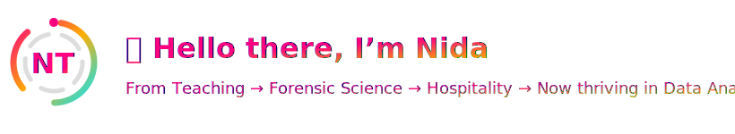

  

---
 ABOUT ME 💁🏻‍♀️

- 🔭 I’m actively working on **shaping my career transition into Data Analytics** — building projects that showcase real-world problem solving with SQL, Python, and BI tools. Currently, I’m also developing a project called **By the Glass**, focused on applying data analysis to real-world business insights.
- 🌱 I’m currently learning **machine learning basics** and pushing my skills in **AI automation for business** to make insights engaging and clear.  
- 👯 I’m looking to collaborate on **open-source data projects, case studies, and analysis challenges** that highlight creativity and practical impact.  
- 🤔 I’m looking for help with **navigating the data industry** as someone coming from hospitality and teaching — understanding how to position my transferable skills effectively.  
- 💬 Ask me about **customer insights, turning operations into numbers, visual storytelling, and how to teach complex topics simply**  
- 😄 Pronouns: **She/Her**  
- ⚡ Fun fact: Whether teaching a class, studying crime scenes, or managing a buzzing restaurant floor — I’ve always chased clarity. Now I just happen to find it in data. 🔍📊
  
---

🌍 Skills That Translate Across Domains

🎓 **Teaching → Communication & Simplification**
I can break down complex ideas into clear, digestible insights — perfect for translating raw data into stories that non-technical stakeholders understand.

🧪**Forensics → Analytical Rigor & Attention to Detail**
Forensic training sharpened my ability to spot patterns, question anomalies, and build evidence-based conclusions — directly transferable to data analysis and modeling.

🍽️ **Hospitality → Resilience & Stakeholder Management**
Years in hospitality taught me adaptability, patience, and how to thrive under pressure while keeping client satisfaction central — crucial for collaborating with teams and delivering value.

💻 **Bootcamp → Modern Data Toolset**
Skilled in SQL, Python, BigQuery,Automation by Zapier, and Looker/Power BI, I now combine people skills with data capabilities to deliver actionable insights.

📊 **Data Analyst Mindset → Business Impact**
I don’t just crunch numbers — I connect the “what” to the “why,” ensuring analysis supports smarter decisions, improved processes, and measurable outcomes.

---
🛠️ Tech Stack / Skills

**Tools & Skills:**  

  <!-- Google Sheets -->
  
  <!-- Microsoft Excel -->
  

  <!-- SQL -->
  

  <!-- BigQuery -->
  

  <!-- Chart.js -->
  

  <!-- Git -->
  

  <!-- dbt -->
  

  <!-- Fivetran -->
  

  <!-- Google Tag Manager -->
  

  <!-- Zapier -->
  

  <!-- Data Governance (generic shield) -->
  

  <!-- Python -->
  

  <!-- BeautifulSoup -->
  

---

📂 Featured Projects

-Project [Streaming Smarter]
  (https://lookerstudio.google.com/reporting/494d411b-2cd2-48cb-8a12-1781b26d1f0d):
  
  **A data analysis project exploring streaming platform content (Netflix, Prime, Disney+, Hulu)**
Data ingestion: Google Sheets (initial logs) + API requests to TMDB for metadata
Storage & querying: BigQuery for scalable data warehousing
Analysis & modeling: Python (Pandas, Scikit-learn) for cleaning, EDA, and predictive modeling
Outcome: Built predictive models to recommend the best platform fit for titles and visualized KPIs (content diversity, audience coverage, ratings)

 **Tech Stack:** 

  
  
  
  
  
  

---

 TIMELINE

  

---

COMMIT CONTRIBUTIONS HEATMAP 

<picture>
  <source media="(prefers-color-scheme: dark)" srcset="./assets/github-snake-dark.svg" />
  <source media="(prefers-color-scheme: light)" srcset="./assets/github-snake.svg" />
  
</picture>

---
🤝 LET'S CONNECT

Links to LinkedIn, Email, Portfolio, Kaggle, etc.

